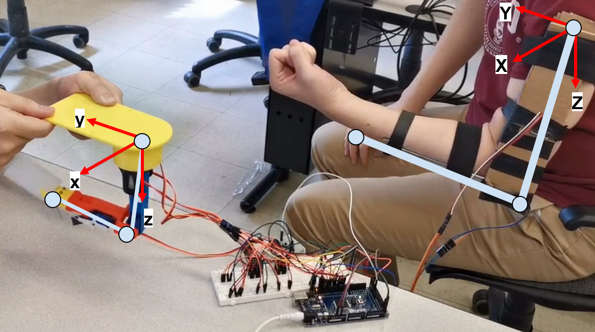
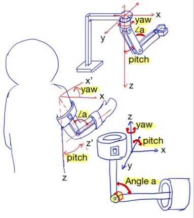

# robotic-arm-follower

video avaliable: https://youtu.be/hgo1tbFBjr8

"Microprocessors and Embedded Microcontrollers" course project. Designed and built a 3D printed Robot Arm which can capture the motion of a human arm and perform the same motion

